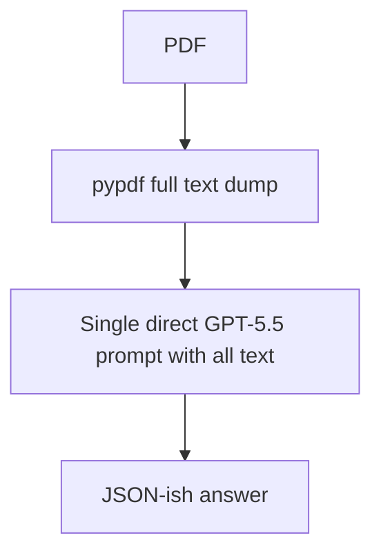

# Budget PDF recurring extraction prototype

Headline version: the chosen architecture is retrieval-first, structure-aware, citation-gated, and versioned. It is built to survive next year's changed page numbering by anchoring to semantic metadata and retrieved quotes, not absolute locations.

## Reference architecture

```mermaid
flowchart TD
  A[PDF version manifest
sha256/year/source] --> B[Ingest + parse
PyPDF layout now; Docling/Unstructured/Marker swappable
closes: layout destruction, schema drift]
  B --> C[Page objects
page text + inferred ministry/demand/section]
  C --> D[Chunk + enrich
parent-child chunks, page overlap, scheme/ministry metadata
closes: chunk boundary severance]
  D --> E[Index
BM25 + local TF-IDF dense surrogate persisted
production: hosted embeddings
closes: retrieval miss]
  E --> F[Retrieve
hybrid score + metadata filters + lightweight rerank
closes: lexical/dense blind spots]
  F --> G[Generate + cite
schema-targeted extraction, forced {answer,page,quote}, refusal gate
closes: hallucinated grounding]
  G --> H[Eval + monitor
ground truth, negative questions, page/number/quote checks]
  H --> I[Recurring-run monitor
versioned ingestion, drift report, year-over-year diffs]
  I -. regression signal .-> D
```

## Naive baseline control



Expected failure modes: long-context degradation, layout/table corruption, weak citations, high latency/cost, and silent failure when annual layout changes.

## Why these components

- Structure-aware parsing: preserves page boundaries and inferred headings/ministry/demand metadata. This reduces layout destruction and makes citations auditable. It does not perfectly reconstruct complex tables; Docling/Unstructured/Marker are the production swap-in if table fidelity or OCR becomes necessary.
- Parent-child chunking: retrieval uses smaller chunks but generation sees neighboring page context. This reduces boundary severance and dangling cross-reference failures. It does not solve ranking by itself.
- Hybrid retrieval: BM25 catches exact scheme names/acronyms; dense/TF-IDF catches broader topic wording. Rerank boosts numeric/table evidence. This reduces retrieval miss but needs eval monitoring.
- Citation-forced schema extraction: every claim must have answer, page, quote; the extractor refuses when grounding is missing. This reduces hallucinated grounding. It cannot invent evidence not retrieved.
- Versioned manifests and eval: sha256 manifests, stable semantic eval questions, negative controls, and page/quote/number scoring catch schema drift across years.

## Evidence used

- FinanceBench, arXiv 2311.11944: financial open-book QA with answers/evidence; reports strong models with retrieval still often wrong/refusing, showing finance PDFs need eval and grounding.
- LegalBench-RAG, arXiv 2408.10343: retrieval benchmark focused on minimal relevant legal snippets; supports precise retrieval for citation quality.
- LongBench v2, arXiv 2412.15204: realistic long-context tasks remain hard even for strong long-context models; supports retrieval-first architecture over dumping 600 pages.
- RULER, arXiv 2404.06654: simple Needle-in-a-Haystack is superficial; use realistic evals plus negative controls.

## Cost/latency rough cut for 600 pages

- PyPDF parse: usually seconds to a few minutes locally.
- Docling/Marker/OCR parse: minutes to hours on CPU depending on pages/tables/scans; faster with GPU.
- Chunks: usually 1k-3k chunks for 600 pages with page/table-aware splitting.
- Embedding/index: local TF-IDF is seconds; hosted embeddings are usually cents-scale for a few million tokens.
- Retrieval: sub-second to a few seconds locally.
- Generation: dominated by top 8 retrieved parent chunks, not the whole PDF.

## How to run

From repository root:

```bash
cd pipeline
./run.sh
```

Outputs:

- `pipeline/data/parsed_pages.json`
- `pipeline/data/chunks.json`
- `pipeline/data/index.pkl`
- `pipeline/output/results_<RUN_NAME>.json`

## How to point at a different PDF

Edit only `pipeline/config.py`:

```python
PDF_PATH = Path("../pdfs/budget_2025_26.pdf")
RUN_NAME = "budget_2025_26_working_class"
```

Then run:

```bash
cd pipeline && ./run.sh
```

## Optional LLM mode

Without `OPENAI_API_KEY`, `extract.py` uses a deterministic citation-gated heuristic so the pipeline remains runnable. With an API key:

```bash
export OPENAI_API_KEY=...
export OPENAI_MODEL=gpt-5.5
cd pipeline && ./run.sh
```

## Baseline

```bash
cd pipeline
python3 -m pip install -q -r requirements.txt
python3 baseline_naive.py
```
