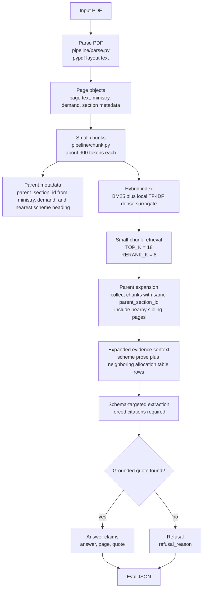

# Hierarchical Retrieval with Parent Expansion

## What this architecture means

Hierarchical Retrieval with Parent Expansion is a small-to-big retrieval architecture. It retrieves precise small chunks first, then expands each retrieved hit to a larger parent section before answer generation.

This architecture answers the question, "Can I keep the precision of small-chunk retrieval while giving the model enough surrounding section context to connect prose, tables, footnotes, and nearby rows?"

It is useful for long structured PDFs where the answer is often split across neighboring layout regions. In this repo, Hybrid Retrieval (Flat Chunks) often retrieved the prose defining a scheme but missed the nearby table row containing the allocation. Parent expansion repairs that by collecting sibling chunks that share the same `parent_section_id` and nearby page context.

This is the same family of patterns as small-to-big retrieval, LangChain's Parent Document Retriever, and LlamaIndex's auto-merging retriever.

## Why this exists

The observed failure pattern was table-prose interleaving. It showed up clearly on these budget questions:

- Q1: VB-G RAM G
- Q2: PMAY-Urban
- Q5: PMVBRY
- Q7: NSAP

In those cases, entity names and explanatory prose were close to, but not always inside, the exact same chunk as the numeric value. Parent expansion keeps the first-stage retrieval focused, then restores the surrounding evidence needed for grounded extraction.

## Architecture



## How it is achieved in this implementation

1. `parse.py` extracts page-level text and metadata from the PDF.
2. `chunk.py` creates small chunks of about 900 tokens.
3. Each chunk receives `parent_section_id`, derived from ministry, demand, and nearest scheme or section heading.
4. The same hybrid index is built over the small chunks using BM25 plus local TF-IDF.
5. The query retrieves high-scoring small chunks first.
6. For each high-scoring hit, `run.py` expands the evidence set to include chunks with the same parent section and nearby sibling pages.
7. Extraction runs over the expanded context, not just the originally retrieved chunk.
8. Every claim must return `answer`, `page`, and `quote`. If the evidence is not found, the method refuses with `refusal_reason`.

The key design choice is to avoid retrieving large parent sections directly. Large sections are often noisy. Instead, the method retrieves precise small chunks, then expands only after it has a strong local signal.

## How to try this with your own PDF

1. Add the PDF:

```bash
mkdir -p pdfs
cp /path/to/your-document.pdf pdfs/my_document.pdf
```

2. Create a config file, for example `configs/my_document.yaml`:

```yaml
pdf_path: pdfs/my_document.pdf
eval_path: eval/ground_truth.json
output_dir: output
run_name: hierarchical_retrieval_parent_expansion_my_document
openai_model: gpt-5.5
```

3. Edit `eval/ground_truth.json` for your document. Include questions that reveal whether section context matters:

- a direct prose lookup
- a table lookup where the row has the answer
- a question where the entity name appears in prose but the value appears in a nearby table
- a cross-reference question
- a negative question where the system should refuse

4. Run the method:

```bash
python3 pipeline/hierarchical_retrieval_parent_expansion/run.py \
  --config configs/my_document.yaml \
  --run-name hierarchical_retrieval_parent_expansion_my_document
```

5. Review the output:

```bash
output/results_hierarchical_retrieval_parent_expansion_my_document.json
pipeline/data_hierarchical_parent_expansion/
```

6. Compare against the other two methods. If this method improves table/prose questions, your document likely benefits from small-to-big retrieval. If it still fails, inspect whether parsing preserved table rows and whether `parent_section_id` grouped the right chunks.

7. Tune for your use case:

- improve heading detection in `pipeline/chunk.py`
- increase or decrease chunk size
- widen or narrow parent expansion
- swap `parse.py` for a table-aware parser such as Docling, Marker, Unstructured, or LlamaParse
- add a domain-specific reranker when many similarly named entities exist

## Component choices

Parser: uses the existing `parse.py` with `pypdf` layout extraction. Docling, Unstructured, Marker, and OCR were not used because this method isolates retrieval behavior rather than parser quality.

Chunking: uses the same small chunks as the flat pipeline. Each chunk also records `parent_section_id`, derived from ministry, demand, and nearest scheme or section heading.

Indexing: uses the existing local hybrid index: BM25 plus TF-IDF from scikit-learn. No hosted embedding model is required. This keeps the experiment runnable offline and comparable to the flat pipeline.

Retrieval: retrieves top small chunks first, then expands each hit to its parent section and neighboring pages. This is the core difference from Hybrid Retrieval (Flat Chunks).

Generation: keeps the same forced-citation contract: every claim must include `answer`, `page`, and `quote`. If grounding is not found, the method returns `refusal_reason`.

## Files

- `run.py` — end-to-end runner for this method
- `README.md` — this document

Shared repo files used by this method:

- `pipeline/parse.py`
- `pipeline/chunk.py`
- `pipeline/index.py`
- `pipeline/hybrid_retrieval_flat_chunks/retrieve.py`
- `pipeline/eval.py`

## How to run the included budget example

From repo root:

```bash
python3 pipeline/hierarchical_retrieval_parent_expansion/run.py \
  --config configs/budget_2026_27.yaml \
  --run-name hierarchical_retrieval_parent_expansion_2026
```

The output is written to:

```bash
output/results_hierarchical_retrieval_parent_expansion_2026.json
```

## What it will not handle

Name disambiguation is still weak. Q5 improved but remained imperfect because similarly named employment schemes and table/prose variants can confuse selection.

Cross-document references were not tested. This method expands within one PDF only.

Image-heavy or scanned PDFs are not handled well because `pypdf` is text-only.

Aggregation queries spanning many sections remain hard. Q8 is the stress case: it requires collecting multiple rows, not simply expanding one parent.

Schema drift across years is only partly addressed. The 2025 run showed mixed results when section structure and scheme availability changed.

Page alignment can remain imperfect because extracted PDF page indices and eval page references may not match exactly.

## Extension points

- Swap `parse.py` for Docling or another table-aware parser.
- Add a name-disambiguation reranker for Q5-class failures.
- Add aggregation logic for Q8-class questions: retrieve multiple parent sections, extract rows, then filter/sort by numeric allocation.
