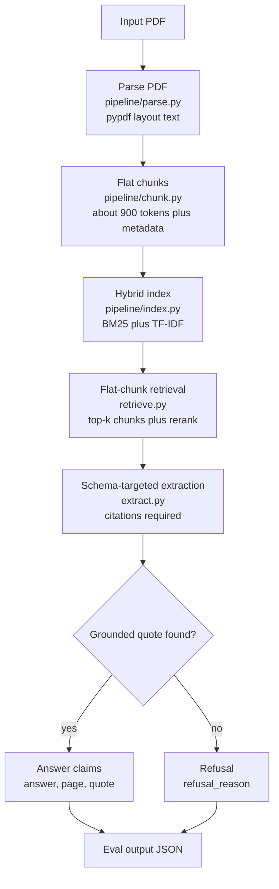

# Hybrid Retrieval (Flat Chunks)

## What this architecture means

Hybrid Retrieval (Flat Chunks) is a standard retrieval-augmented generation architecture for long PDFs. The PDF is parsed into pages, split into moderately sized chunks, indexed with lexical retrieval and a local dense surrogate, and then queried with hybrid retrieval before answer generation.

This architecture answers the question, "Can I find the most relevant chunks first, then generate only from those chunks with citations?"

It is usually stronger than Full-Context Dump for long documents because the model sees a smaller, more focused evidence set. It is also more auditable because every answer can be traced to retrieved chunks. Its main weakness is that each chunk is treated independently. If a scheme description is in one chunk and the allocation table row is in a neighboring chunk, the retriever may find one but not the other.

## Architecture



## How to try this with your own PDF

1. Add the PDF:

```bash
mkdir -p pdfs
cp /path/to/your-document.pdf pdfs/my_document.pdf
```

2. Create a config file, for example `configs/my_document.yaml`:

```yaml
pdf_path: pdfs/my_document.pdf
eval_path: eval/ground_truth.json
output_dir: output
run_name: hybrid_retrieval_flat_chunks_my_document
openai_model: gpt-5.5
```

3. Define your evaluation set in `eval/ground_truth.json`. For this architecture, include questions that test whether retrieval finds the right chunk:

- prose lookup questions
- numeric table lookup questions
- questions where names and numbers appear near each other but not necessarily on the same line
- negative questions where the system should refuse if evidence is absent

4. Run the pipeline:

```bash
python3 pipeline/hybrid_retrieval_flat_chunks/run.py \
  --config configs/my_document.yaml \
  --run-name hybrid_retrieval_flat_chunks_my_document
```

5. Inspect outputs and retrieval behavior:

```bash
output/results_hybrid_retrieval_flat_chunks_my_document.json
pipeline/data_hybrid_flat_chunks/
```

6. If this method misses values that are visibly near retrieved chunks, your use case may need Hierarchical Retrieval with Parent Expansion. If it retrieves irrelevant sections, tune metadata, chunk size, query wording, or reranking.

## Files

- `run.py` — end-to-end runner for this method
- `retrieve.py` — hybrid retrieval over flat chunks
- `extract.py` — schema-targeted extraction from retrieved chunks
- `README.md` — this document

Shared repo files used by this method:

- `pipeline/parse.py`
- `pipeline/chunk.py`
- `pipeline/index.py`
- `pipeline/eval.py`
- `pipeline/config.py`

## How to run the included budget example

From repo root:

```bash
python3 pipeline/hybrid_retrieval_flat_chunks/run.py \
  --config configs/budget_2026_27.yaml \
  --run-name hybrid_retrieval_flat_chunks_2026
```

## Known limitations from this experiment

The dominant failure mode was table-prose interleaving: the retriever found prose defining a scheme but missed the sibling table row containing the allocation. This showed up in Q1, Q2, Q5, and Q7.
